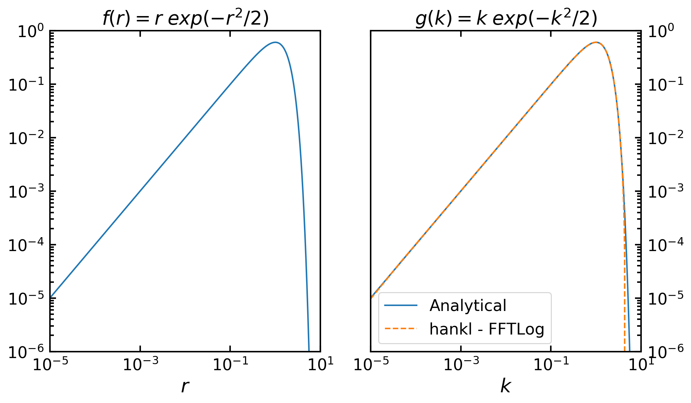
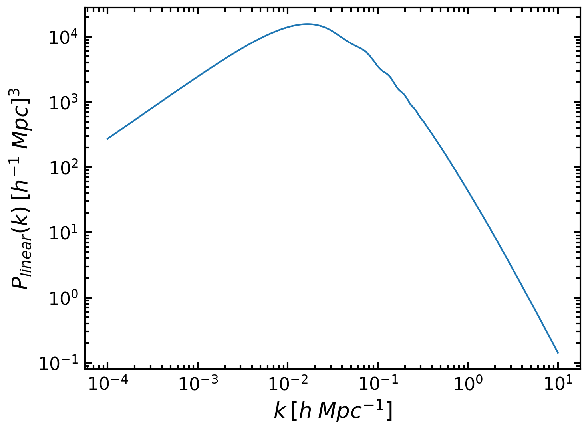
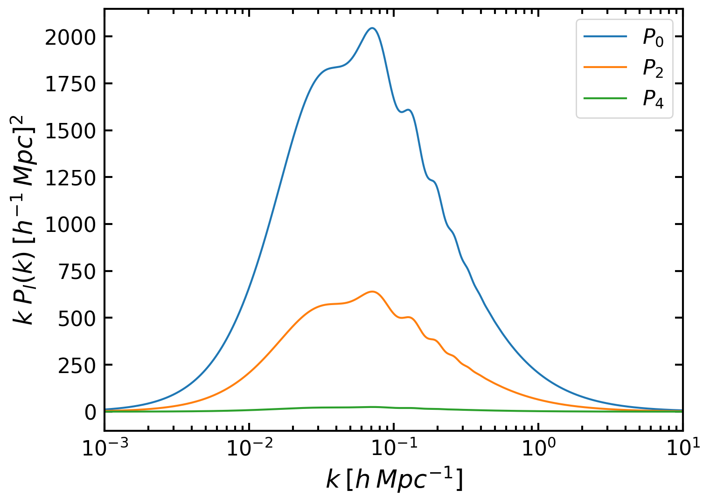
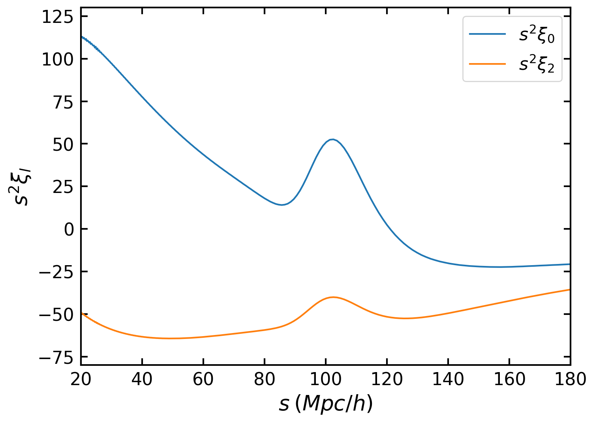

========
Examples
========

This section includes two examples. The first one uses the General FFTLog module and the second uses the Cosmology module.

General FFTLog Example
----------------------

This is a simple example, used by Hamilton to illustrate how the FFTLog algorithm works.
We will use **hankl**'s General FFTLog module to compute the following transform:

    .. math:: \int_{0}^{\infty} r^{\mu + 1} exp\Big(-\frac{r^{2}}{2}\Big) J_{\mu}(k r) k dr = k^{\mu+1} exp\Big(-\frac{k^{2}}{2}\Big)

Now in this example we know the analytical form of the result so we will use this to
demonstrate the accuracy of the transformation.

The general form of the Hankel transform that **hankl** computes is the following:

    .. math:: g(k) = \int_0^\infty f(r) (kr)^{q} J_\mu(kr) k dr

This means that the function that we want to transform is:

    .. math:: f(r) = r^{\mu+1} exp\Big(-\frac{r^{2}}{2}\Big)

and the result should be

    .. math:: g(k) = k^{\mu+1} exp\Big(-\frac{k^{2}}{2}\Big)

which is of course the right hand side (RHS) of the first equation.

Now let's start by importing everything we need::

    import hankl
    import numpy as np
    import matplotlib.pyplot as pyplot

The next thing we want is to define the functions f(r) and g(r) as well as the integration range for *r*::

    def f(r, mu=0.0):
        return r**(mu+1.0) * np.exp(-r**2.0 / 2.0)

    def g(k, mu=0.0):
        return k**(mu+1.0) * np.exp(- k**2.0 / 2.0)

    r = np.logspace(-5, 5, 2**10)

As you can see, we used an integration range for *r* which is quite wide and we also chose its size to be
a power of two, this will make the algorithm faster and more accurate.

Now let's perform the Hankel transform::

    k, G = hankl.FFTLog(r, f(r, mu=0.0), q=0.0, mu=0.0)

Finally, we can plot the results::

    plt.figure(figsize=(10,6))

    ax1 = plt.subplot(121)
    plt.loglog(r, f(r))
    plt.title('$f(r) = r \; exp(-r^{2}/2)$')
    plt.xlabel('$r$')
    plt.ylim(10**(-6), 1)
    plt.xlim(10**(-5), 10)

    ax1.yaxis.tick_left()
    ax2.yaxis.set_label_position("left")

    ax2 = plt.subplot(122, sharey=ax1)
    plt.loglog(k, g(k), label='Analytical')
    plt.loglog(k, G, ls='--', label='hankl - FFTLog')
    plt.title('$g(k) = k \; exp(-k^{2}/2)$')
    plt.xlabel('$k$')
    plt.ylim(10**(-6), 1)
    plt.xlim(10**(-5), 10)
    plt.legend()

    ax2.yaxis.tick_right()
    ax2.yaxis.set_label_position("right")
    plt.tight_layout()

    plt.show()

We can further impove the performace of **hankl** by enabling the 'lowring' option, extrapolating or
zero/constant padding the function (See the API for more information).

Cosmology Example
-----------------

In this example we will start from a model of the Galaxy Power Spectrum and our goal is to transform it
to Configuration space to get the respective model for the Galaxy 2-Point Correlation Function. Furthermore,
we want to transform both the Monopole and the Quadrupole of the Power Spectrum.

Let's start by importing all the required packages; we will use *classylss* to get the *Linear Matter Power Spectrum*::

    import hankl
    import numpy as np
    import matplotlib.pyplot as plt
    import classylss
    import classylss.binding as CLASS

Now that we have imported everything we need let's initialize the fiducial Cosmology of our model::
    
    engine = CLASS.ClassEngine({'H0':70, 'Omega_m':0.31})
    bg = CLASS.Background(engine)
    cosmo = CLASS.ClassEngine({'output': 'dTk vTk mPk', 'non linear': 'halofit', 'P_k_max_h/Mpc' : 20., "z_max_pk" : 100.0})
    sp = CLASS.Spectra(cosmo)

The next step is to define a suitable *k range* and get the model for the *Linear Matter Power Spectrum*::

    k = np.logspace(-4, 1, 2**10)
    pk_lin = sp.get_pklin(k=k, z=0.5)

where we also needed to specify the effective redshift *z=0.5*. We can plot easily the Linear Power Spectrum::

    plt.loglog(k, pk_lin)
    plt.xlabel(r'$k\: [h\; Mpc^{-1}]$')
    plt.ylabel(r'$P_{linear}(k)\: [h^{-1}\; Mpc]^{3}$')
    plt.show()

Now, this was the linear Matter Power Spectrum, to get the Galaxy Power Spectrum multipoles we will use *Kaiser*'s formula:

    .. math:: P(k, \mu) = (b + f \mu^{2})^{2} P_{lin}(k)

where :math:`b` is the *linear bias parameter*, :math:`f` is the *logarithmic growth rate*, and :math:`\mu` is the cosine of the
angle between teh Fourier modes and the line-of-sight. By decomposing the aforementioned function in terms of the *Legendre polynomials*
we get the Monopole :math:`(l=0)`, Quadrupole :math:`(l=2)` and Hexadecapole :math:`(l=4)` of the galaxy Power Spectrum::

    def get_multipoles(b, f):

        p0 = (b*b + 2.0 * b *f / 3.0 + f*f/5.0 ) * pk_lin

        p2 = (4.0*b*f/3.0 + 4.0*f*f/7.0) * pk_lin

        p4 = (8.0* f*f / 35.0) * pk_lin

    return p0, p2, p4

Alright, let's compute and plot those multipoles for two realistic values of *b* and *f*::

    P0, P2, P4 = get_multipoles(b=2.0, f=0.5)

    plt.semilogx(k, k * P0, label=r'$P_{0}$')
    plt.semilogx(k, k * P2, label=r'$P_{2}$')
    plt.semilogx(k, k * P4, label=r'$P_{4}$')
    plt.xlabel(r'$k \: [h\: Mpc^{-1}]$')
    plt.ylabel(r'$k\; P_{l}(k) \: [h^{-1}\: Mpc]^{2}$')
    plt.xlim(1e-3, 10)
    plt.legend()
    plt.show()

The last step involves using the Cosmology module P2xi to transform the above power spectrum multipoles
to correlation function multipoles and plot them. Since the Hexadecapole (l=4) is almost zero, we will
do the transform only for the Monopole and Quadrupole::

    s, xi0 = hankl.P2xi(k, P0, l=0)
    s, xi2 = hankl.P2xi(k, P2, l=2)

    plt.plot(s, s*s*xi0, label=r'$s^{2}\xi_{0}$')
    plt.plot(s, s*s*xi2, label=r'$s^{2}\xi_{2}$')
    plt.xlim(20,180)
    plt.ylim(-80,130)
    plt.xlabel(r'$s\: (Mpc/h)$')
    plt.ylabel(r'$s^{2} \xi_{l}$')
    plt.legend()
    plt.show()

As expected we can see the Baryon Acoustic Oscillations (BAO) peak in both multipoles.

.. toctree::
   :maxdepth: 4
   :caption: Contents:
   :hidden: